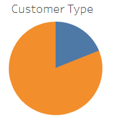
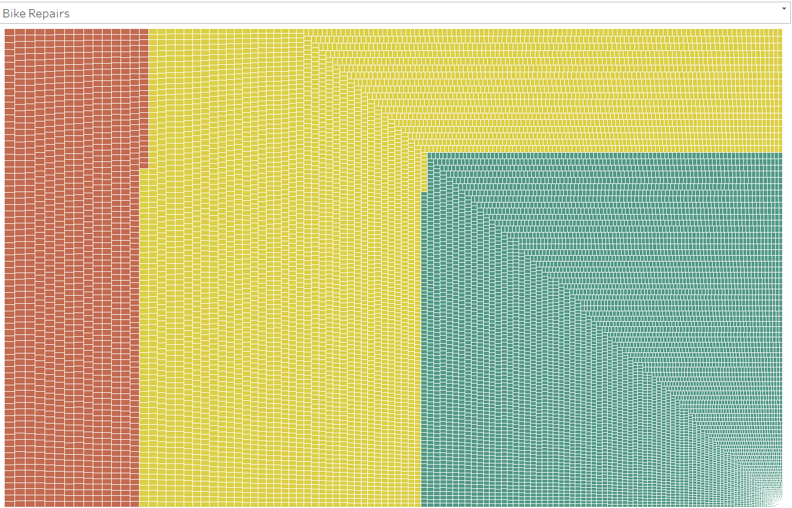
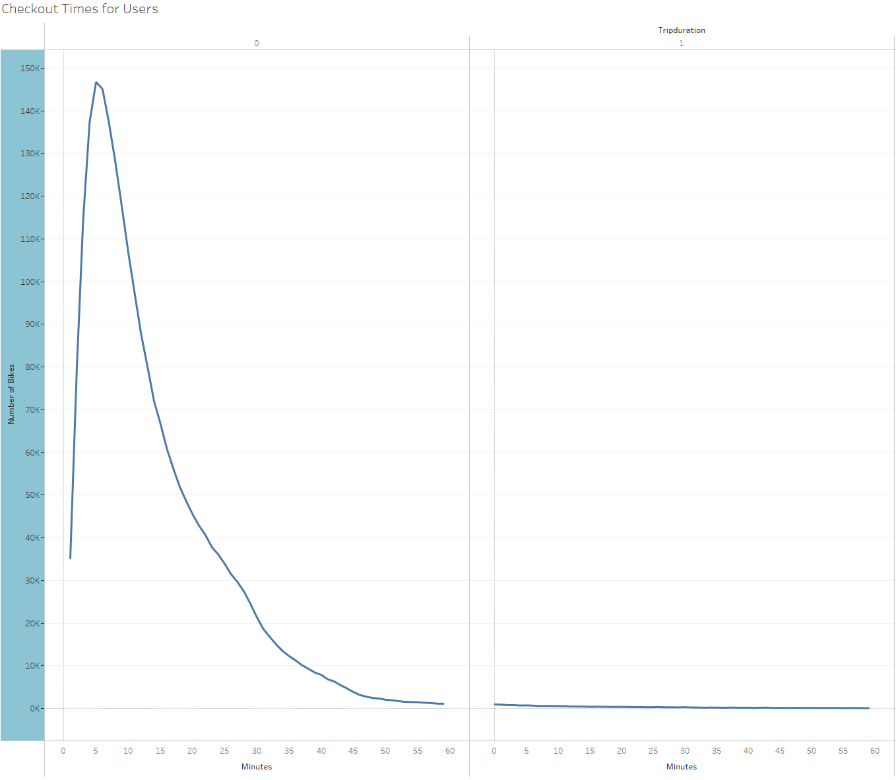
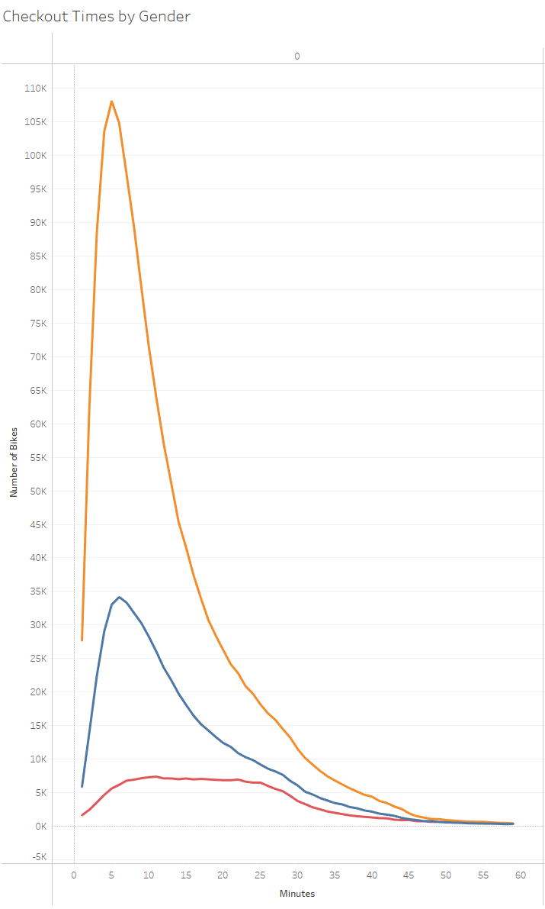
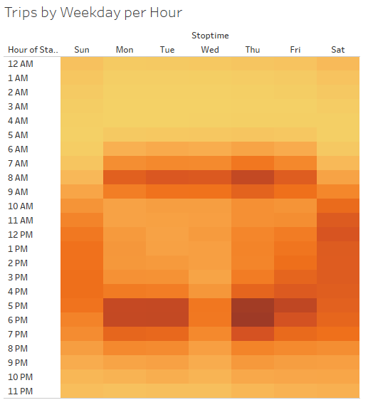
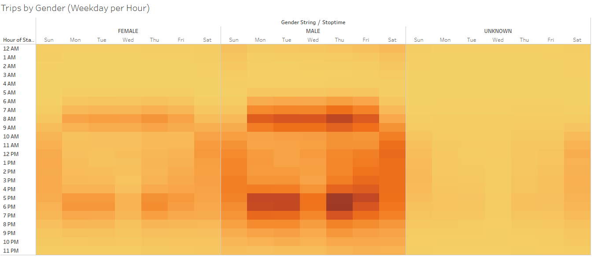
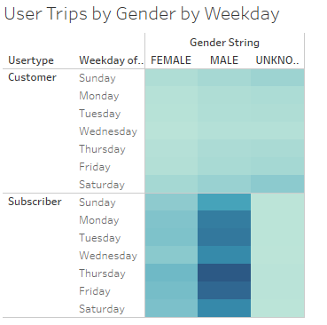

# Overview
After noticing the success of a bike rental comapny in New York City, the company is looking into what factors should be considered to replicate the success in Des Moines, Iowa. 

We will be looking into the length of time that bikes are checked out for. In addition, the numbers of riders by day and hour of the week will help us determine when the bikes should be utilized. We will also look at the user type to determine if we should launch a subscription or pay per rental fee.

We will be making the assumption that Des Moines population will have similar acceptance as the New York markets.

# Results

Looking at the data from New York City, they had a total of 2.3M users. First we'll look at the breakdown of customer types.

In New York City, 81% of the users were subscribers of the rental program. This is a great number to see since this is s constant inflow of revenue which helps maintain and purchase bikes. 

The bike repairs shown highlights that only a small percentage of bikes are requiring maintenance based on their usage. This is where the subscriber revenue will help with these costs.

Checkout times tend to be relatively short. The most common time is 5 minutes, but majority of checkouts last less than 45 minutes. This may change if Des Moines is not as densly packed as New York City.

The checkout times by gender reveal that the checkout times by women decreases slower than the males. It also shows that males make up a significant number of the users.

Looking at the time of day for the checkouts, it is visible that these bikes are being used for commutes. The heatmaps show peaks weekdays in the morning around 8 am and 5pm. There appears to be consistent usage on Saturday and Sunday during the day.

Breaking out the Weekday Hour heat map by gender does not revail any new conclusions. They genders follow the same patterns.

User trips by Gender does give some good insight into our user base. As expected, users who have a subscription tend to use the bikes more often than regular customers. Again the males show a higher utilization than female.

# Summary
Based on the analysis of the New York City data, we may want to focus on quickly growing the male user base in Des Moines. Additional visualizations may be helpful to address these additional questions.
- Bike counts at ending and starting stations - This will help us better understand if there is any need to move bikes around to ensure that they are avaible where people are. If all the bikes end up at one location, this will limit the ability of riders to checkout the bikes.
- Age and duration of the checkout - For a marketing perspective it may be good to understand if a certain age bracket tends to ride longer. If this is the case we may be able to segment out premium bikes for those who want to ride longer.

You can see additional analysis in the Tableau Story linked below:
[Linke to Dashboard](https://public.tableau.com/app/profile/drew.motylinski/viz/NYCCityBikes_16478996449410/NYCCitiBikes)
